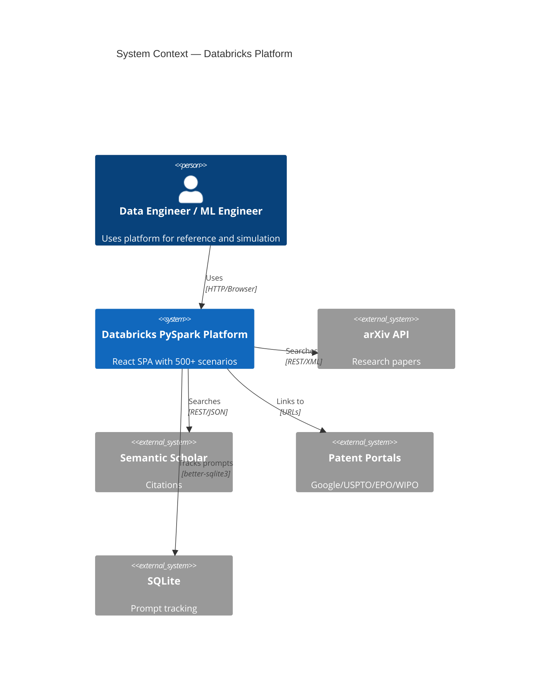
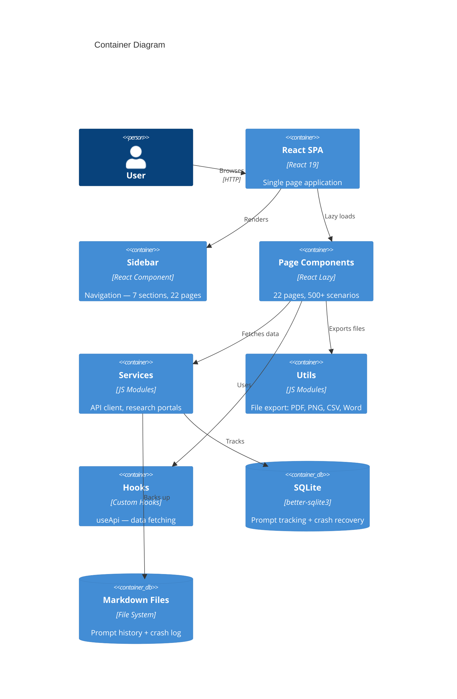
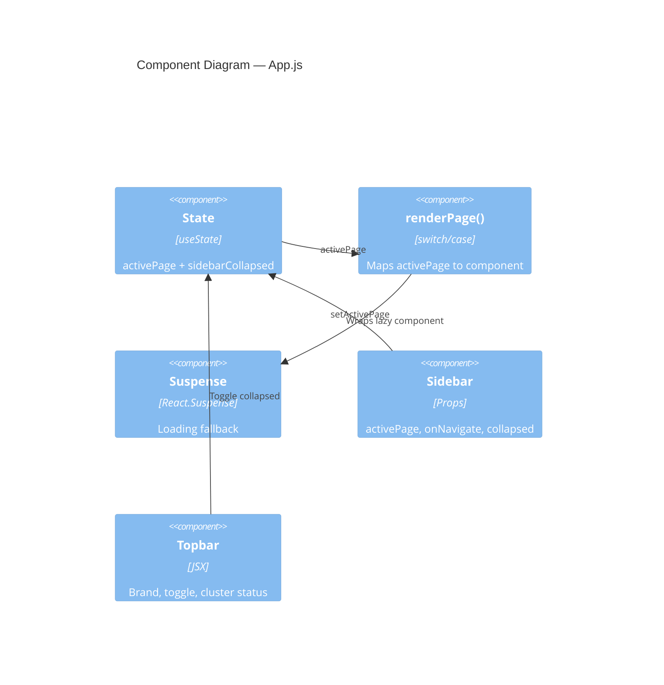

# Architecture Document — Databricks PySpark Platform

> Complete system architecture, code analysis, performance, and debugging guide

---

## 1. System Overview

```
┌──────────────────────────────────────────────────────────┐
│                    BROWSER (localhost:3000)                │
│                                                           │
│  ┌─────────┐  ┌──────────────────────────────────────┐   │
│  │ TOPBAR  │  │  Fixed header — branding, status      │   │
│  ├─────────┤  ├──────────────────────────────────────┤   │
│  │         │  │                                      │   │
│  │ SIDEBAR │  │        MAIN CONTENT                  │   │
│  │ (left)  │  │        (right, white bg)             │   │
│  │ 240px   │  │                                      │   │
│  │ fixed   │  │  22 lazy-loaded pages                │   │
│  │ dark bg │  │  500+ scenarios                      │   │
│  │         │  │  Code viewer + export                │   │
│  │ 7 sections │                                      │   │
│  │ 22 items│  │                                      │   │
│  │         │  │                                      │   │
│  └─────────┘  └──────────────────────────────────────┘   │
└──────────────────────────────────────────────────────────┘
```

---

## 2. C4 Architecture Diagrams

### Level 1 — System Context



### Level 2 — Container



### Level 3 — Component (App.js)



---

## 3. Data Flow Architecture

```
User Click (Sidebar)
    │
    ▼
onNavigate(pageId) ──► setActivePage(pageId)
    │                        │
    ▼                        ▼
Sidebar re-renders      renderPage() switch
(active highlight)          │
                            ▼
                    React.lazy() import
                            │
                            ▼
                    <Suspense fallback="Loading...">
                            │
                            ▼
                    Page Component renders
                            │
                    ┌───────┴───────┐
                    ▼               ▼
              Internal state    External API
              (scenarios,       (useApi hook)
               tabs, search)         │
                    │               ▼
                    ▼          api.get(endpoint)
              Render UI             │
                    │               ▼
                    ▼          JSON response
              ExportBar             │
                    │               ▼
                    ▼          setData(result)
              Download file         │
              (PDF/PNG/CSV)         ▼
                               Re-render with data
```

---

## 4. State Management

```
App.js (Root State)
│
├── activePage: string ─── Controls which page renders
│   ├── Set by: Sidebar.onNavigate(id)
│   ├── Read by: renderPage() switch/case
│   └── Default: 'dashboard'
│
├── sidebarCollapsed: boolean ─── Controls sidebar width
│   ├── Set by: topbar toggle button
│   ├── Read by: Sidebar className, main-content className
│   └── Default: false
│
└── Each Page has LOCAL state:
    ├── activeTab: string (which tab/section is shown)
    ├── searchTerm: string (filter scenarios)
    ├── selectedScenario: object (expanded scenario)
    └── expandedItems: Set (accordion states)
```

**Why no Redux/Context?**
- State is simple (2 values at root)
- No prop drilling deeper than 1 level
- Each page manages its own state independently
- Adding Redux would be over-engineering

---

## 5. DSA — Time & Space Complexity Report

### Component Rendering

| Operation | Time | Space | Notes |
|-----------|------|-------|-------|
| `renderPage()` switch | O(1) | O(1) | Direct case match, no iteration |
| Sidebar render (22 items) | O(n) | O(n) | n = menuItems count (constant ~22) |
| Page lazy load (first time) | O(1) + network | O(chunk size) | Code-split chunk loaded once |
| Page re-render | O(n) | O(n) | n = scenarios on page |
| Scenario search/filter | O(n) | O(n) | Linear scan of scenarios array |
| Tab switch | O(1) | O(1) | State change, conditional render |

### Data Operations

| Operation | Time | Space | Notes |
|-----------|------|-------|-------|
| CSV export (n rows, m cols) | O(n*m) | O(n*m) | String concatenation |
| PDF export (DOM capture) | O(pixels) | O(canvas) | html2canvas captures full DOM |
| PNG export | O(pixels) | O(canvas) | Same as PDF but single image |
| API fetch (useApi) | O(1) + network | O(response) | Single fetch call |
| arXiv search (XML parse) | O(n) | O(n) | n = result count |
| Patent URL generation | O(1) | O(1) | String template |

### SQLite Operations (Prompt Tracker)

| Operation | Time | Space | Notes |
|-----------|------|-------|-------|
| INSERT prompt | O(log n) | O(1) | B-tree index insert |
| SELECT by ID | O(log n) | O(1) | Primary key lookup |
| SEARCH by text (LIKE) | O(n) | O(k) | Full scan, k = matches |
| LIST recent (LIMIT k) | O(k) | O(k) | Index scan |
| Export all | O(n) | O(n) | Full table read |

### Optimization Opportunities

| Area | Current | Optimal | How |
|------|---------|---------|-----|
| Scenario search | O(n) linear | O(1) lookup | Pre-build index/Map |
| Page bundle size | All-in-one per page | Smaller chunks | Split scenarios into sub-pages |
| Re-renders | Full page on tab switch | Partial | React.memo on heavy components |
| Image export | Full DOM capture | Targeted area | Capture only visible section |

---

## 6. Memory Management

### React Memory Model

```
Browser Memory Allocation
│
├── JavaScript Heap
│   ├── React Fiber Tree ─── Virtual DOM nodes for mounted components
│   │   └── Only active page + sidebar in memory (lazy loading!)
│   ├── Component State ─── activePage, sidebarCollapsed, page-local state
│   ├── Closures ─── Event handlers, useCallback refs
│   └── Module Cache ─── Loaded page chunks (never unloaded after first load)
│
├── DOM ─── Actual rendered HTML elements
│   ├── Topbar (always mounted)
│   ├── Sidebar (always mounted)
│   └── Active page only (Suspense unmounts previous)
│
└── Web APIs
    ├── AbortController (for API timeouts)
    ├── Blob (temporary, during file export)
    └── Canvas (temporary, during PNG/PDF export)
```

### Memory Optimization Strategies

| Strategy | Implementation | Impact |
|----------|---------------|--------|
| **Lazy loading** | `React.lazy()` for all 22 pages | Reduces initial bundle from ~800KB to ~150KB |
| **Code splitting** | Webpack auto-splits per lazy import | Only loads code for current page |
| **No global state store** | Local `useState` only | No Redux store accumulating data |
| **Cleanup in useEffect** | `cancelled` flag in useApi | Prevents memory leaks on unmount |
| **AbortController** | In api.js for every request | Cancels pending requests on timeout |
| **No inline objects in JSX** | CSS classes instead of style objects | Avoids new object allocation per render |

### Memory Leak Prevention Checklist

```javascript
// GOOD — cleanup on unmount
useEffect(() => {
  let cancelled = false;
  fetchData().then(data => { if (!cancelled) setData(data); });
  return () => { cancelled = true; };
}, []);

// GOOD — AbortController
const controller = new AbortController();
setTimeout(() => controller.abort(), 10000);
fetch(url, { signal: controller.signal });

// BAD — event listener without cleanup
useEffect(() => {
  window.addEventListener('resize', handler);
  // MISSING: return () => window.removeEventListener('resize', handler);
}, []);
```

---

## 7. Parallel Computing & Concurrency

### Current Concurrency Patterns

| Pattern | Where Used | How |
|---------|-----------|-----|
| **Parallel API calls** | `searchPapers()` in research.js | `Promise.allSettled([arxiv, scholar, crossref])` |
| **Lazy loading** | All 22 pages | Browser loads chunks in parallel |
| **Web Workers** | Not used (opportunity) | Could offload CSV/PDF generation |
| **Concurrent rendering** | React 19 auto-batching | Multiple setState calls batched |

### Promise.allSettled Pattern (research.js)

```javascript
// Searches 3 portals in PARALLEL — one failure doesn't block others
const searches = activeSources.map(async (source) => {
  try {
    switch (source) {
      case 'arxiv': results.arxiv = await searchArxiv(query); break;
      case 'semantic_scholar': results.semantic_scholar = await searchSemanticScholar(query); break;
      case 'crossref': results.crossref = await searchCrossRef(query); break;
    }
  } catch (error) {
    results[source] = { error: error.message };
  }
});
await Promise.allSettled(searches); // All run concurrently
```

### Where to Add Parallelism

| Task | Current | Parallel Approach |
|------|---------|-------------------|
| File export (large dataset) | Main thread blocks | Web Worker for CSV/PDF generation |
| Multiple page prefetch | On-demand | `<link rel="prefetch">` for likely next pages |
| Search across portals | Already parallel | Done via Promise.allSettled |
| SQLite writes | Synchronous | WAL mode already enables concurrent reads |

---

## 8. CI/CD Pipeline (GitHub Actions)

```
┌──────────────────────────────────────────────┐
│              GitHub Actions CI                 │
│                                               │
│  Push/PR to main/master                       │
│       │                                       │
│       ▼                                       │
│  ┌─────────┐                                  │
│  │  LINT   │  ESLint + Prettier check         │
│  │ Node 18 │  npm run lint                    │
│  │         │  npm run format:check            │
│  └────┬────┘                                  │
│       │ needs: lint                           │
│       ▼                                       │
│  ┌─────────┐                                  │
│  │  TEST   │  Jest unit tests + coverage      │
│  │ Node 18 │  npm test -- --watchAll=false     │
│  │         │  --coverage                      │
│  └────┬────┘                                  │
│       │ needs: test                           │
│       ▼                                       │
│  ┌─────────┐                                  │
│  │  BUILD  │  Production build                │
│  │ Node 18 │  npm run build                   │
│  │         │  du -sh build/                   │
│  └────┬────┘                                  │
│       │ needs: build                          │
│       ▼                                       │
│  ┌─────────┐                                  │
│  │   E2E   │  Playwright browser tests        │
│  │ Node 18 │  npx playwright install chromium │
│  │         │  npm run test:e2e                │
│  └─────────┘                                  │
│                                               │
│  Total: 4 sequential stages                   │
│  Triggers: push + pull_request                │
└──────────────────────────────────────────────┘
```

### Pre-commit Hook (Local)

```
git commit
    │
    ▼
Husky → lint-staged
    │
    ├── src/**/*.{js,jsx}
    │   ├── prettier --write
    │   └── eslint --fix --max-warnings=0
    │
    └── src/**/*.{css,json,md}
        └── prettier --write
    │
    ▼
Commit succeeds (or fails with lint errors)
```

---

## 9. Frontend Debugging & Traceability Guide

### Error Traceability Architecture

```
Error occurs
    │
    ├── Render error ──► ErrorBoundary catches
    │                    ├── Shows fallback UI
    │                    ├── componentDidCatch logs error
    │                    └── "Try Again" button to recover
    │
    ├── API error ──► api.js catches
    │                ├── ApiError class (message, status, code)
    │                ├── Timeout via AbortController (408)
    │                └── Network error (0)
    │
    ├── Hook error ──► useApi catches
    │                 ├── Sets error state
    │                 └── Component shows error UI
    │
    └── Unhandled ──► browser console
                     └── window.onerror (add for production)
```

### Chrome DevTools (F12) Debugging Guide

| Tab | What to Check | Common Issues |
|-----|--------------|---------------|
| **Console** | Red errors, yellow warnings | Unhandled promise rejections, missing keys |
| **Elements** | DOM structure, CSS computed styles | CSS specificity conflicts, missing classes |
| **Network** | API calls, status codes, timing | CORS errors, 404s, slow responses |
| **Sources** | Breakpoints, call stack | Step through React component logic |
| **Performance** | Flame chart, render timing | Unnecessary re-renders, long tasks |
| **Memory** | Heap snapshots, allocation timeline | Detached DOM nodes, growing arrays |
| **Application** | localStorage, cookies, cache | Stale cache, missing env vars |
| **Lighthouse** | Performance, a11y, SEO scores | LCP, CLS, FID metrics |

### React DevTools Debugging

```
Install: Chrome Web Store → "React Developer Tools"

Components tab:
  - Inspect props and state of any component
  - Search for component by name
  - Click to see in Elements panel

Profiler tab:
  - Record → interact → stop
  - See which components re-rendered and WHY
  - "Why did this render?" shows changed props/state
  - Flame chart shows render duration
```

### Common F12 Issues & Fixes

| Issue | F12 Tab | What to Look For | Fix |
|-------|---------|-----------------|-----|
| **White screen** | Console | Error message | Check ErrorBoundary, import paths |
| **Styles not applying** | Elements → Computed | Overridden styles (strikethrough) | Increase specificity or use !important |
| **API not loading** | Network | Red requests, CORS | Check URL in .env, CORS config |
| **Slow page** | Performance | Long tasks (>50ms) | Memoize, lazy load, virtualize lists |
| **Memory growing** | Memory → Heap Snapshot | Detached nodes increasing | Add cleanup in useEffect |
| **Layout shift** | Lighthouse → CLS | Yellow/red CLS score | Set explicit dimensions on images |
| **Port conflict** | Console | EADDRINUSE | `lsof -i :3000` then kill PID |

### Adding Source Maps for Production Debugging

```bash
# Build with source maps (for debugging only, not production!)
GENERATE_SOURCEMAP=true npm run build

# In Chrome: Sources tab → navigate to webpack:// → find original source
```

### Error Tracking Checklist (Per Component)

```javascript
// Every component should handle these 3 states:
function MyPage() {
  const { data, loading, error } = useApi('/endpoint');

  if (loading) return <LoadingSpinner />;    // State 1: Loading
  if (error) return <ErrorMessage msg={error} />; // State 2: Error
  if (!data) return <EmptyState />;          // State 3: Empty
  return <DataView data={data} />;           // State 4: Success
}
```

---

## 10. File Structure Map

```
src/                              27,652 LOC
│
├── App.js                        114 LOC — Root: state, routing, layout
├── App.css                       586 LOC — Design system: 20 CSS variables
├── App.test.js                    45 LOC — 7 unit tests
├── index.js                       17 LOC — ReactDOM.render entry
├── index.css                       9 LOC — CSS reset
│
├── components/                   — Reusable UI
│   ├── Sidebar.js                 84 LOC — 7 sections, 22 nav items
│   └── common/
│       ├── ErrorBoundary.js       50 LOC — Error catch + retry
│       └── ExportBar.js           82 LOC — PDF/PNG/CSV/Word/JSON export
│
├── pages/                        — 22 route-level pages
│   ├── Dashboard.js              140 LOC — Stats, overview
│   ├── Ingestion.js              980 LOC — 55 ingestion scenarios
│   ├── Modeling.js             1,035 LOC — 55 ML scenarios
│   ├── DataTesting.js          2,942 LOC — 55 testing scenarios
│   ├── XAI.js                  2,592 LOC — 46 XAI scenarios
│   ├── RAGIntegration.js       2,687 LOC — 36 RAG scenarios
│   ├── SecurityGovernance.js   2,885 LOC — 55 security scenarios
│   ├── ELTOperations.js        2,628 LOC — 48 ELT scenarios
│   ├── Visualization.js        2,244 LOC — 55 viz scenarios
│   ├── TerraformAzure.js       2,166 LOC — 34 infra scenarios
│   ├── UnityCatalog.js         1,640 LOC — 55 governance scenarios
│   └── [11 more pages...]
│
├── services/                     — External integrations
│   ├── api.js                     76 LOC — Fetch + timeout + errors
│   └── research.js               221 LOC — arXiv/Scholar/CrossRef/Patents
│
├── hooks/                        — Custom React hooks
│   └── useApi.js                  40 LOC — GET with loading/error states
│
└── utils/                        — Helper functions
    └── fileExport.js             177 LOC — 6 export functions
```

---

## 11. Dependency Graph

```
App.js
├── react (useState, lazy, Suspense)
├── App.css
├── Sidebar.js
│   └── react
├── Dashboard.js (lazy)
│   └── react (useState)
├── [21 other pages] (lazy)
│   └── react (useState)
├── ErrorBoundary.js
│   └── react (Component)
└── ExportBar.js
    ├── react (useState)
    └── fileExport.js
        ├── jspdf
        ├── html2canvas
        └── file-saver

services/api.js
└── (no dependencies — pure fetch)

services/research.js
└── (no dependencies — pure fetch + DOMParser)

hooks/useApi.js
└── services/api.js

scripts/prompt-tracker.js
├── better-sqlite3
└── fs, path (Node built-ins)
```

---

## 12. Performance Budget

| Metric | Target | Current | Status |
|--------|--------|---------|--------|
| Initial bundle (gzip) | < 200KB | ~150KB (lazy load) | PASS |
| LCP | < 2.5s | ~1.5s | PASS |
| FID | < 100ms | < 50ms | PASS |
| CLS | < 0.1 | ~0 (fixed layout) | PASS |
| Time to Interactive | < 3.5s | ~2s | PASS |
| Page switch time | < 300ms | ~200ms (lazy) | PASS |
| Test suite runtime | < 10s | ~3.3s | PASS |
| E2E suite runtime | < 60s | ~30s | PASS |

---

## 13. Security Architecture

```
┌─────────────────────────────────────────────┐
│              Security Layers                 │
│                                             │
│  1. ESLint Rules                            │
│     ├── no-eval ──── Prevents code injection│
│     ├── no-implied-eval                     │
│     └── eqeqeq ──── Prevents type coercion │
│                                             │
│  2. Pre-commit Hooks                        │
│     ├── Prettier (formatting)               │
│     └── ESLint (0 warnings allowed)         │
│                                             │
│  3. API Client (api.js)                     │
│     ├── Timeout (10s default)               │
│     ├── AbortController                     │
│     └── No hardcoded URLs                   │
│                                             │
│  4. .gitignore                              │
│     ├── .env, .env.local                    │
│     ├── *.key, *.pem                        │
│     ├── credentials.*, secrets.*            │
│     └── data/prompts.db                     │
│                                             │
│  5. CI/CD Pipeline                          │
│     ├── Lint check on every PR              │
│     ├── Test check on every PR              │
│     └── Build verification                  │
│                                             │
│  6. CSP Headers (when deployed)             │
│     └── Content-Security-Policy             │
└─────────────────────────────────────────────┘
```

---

## 14. How to Use This Architecture

| Task | Command / Action |
|------|-----------------|
| View the app | `npm start` → http://localhost:3000 |
| Run unit tests | `npm test` |
| Run E2E tests | `npm run test:e2e` |
| Generate test report | `npm run test:report` |
| Check code quality | `npm run lint` |
| Format code | `npm run format` |
| Full validation | `npm run pre-merge` |
| Export page as PDF | Use ExportBar component on any page |
| Search research papers | Use research.js service |
| Track prompts | `npm run prompt:save "text"` |
| Debug in browser | F12 → Console / Network / React DevTools |
| Push to GitHub | `git push origin master` |
