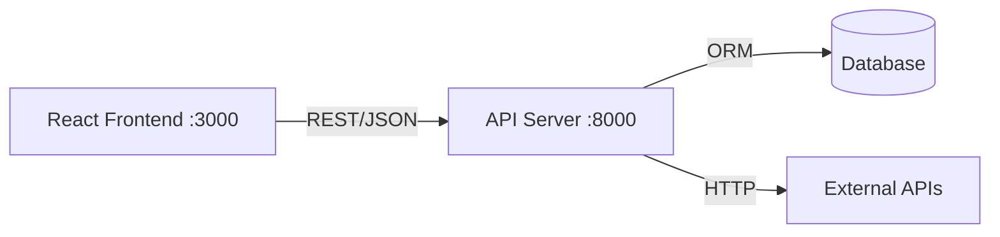

# Frontend + Backend + ORM Integration Guide

> Mandatory reference for connecting frontend to any backend/database

---

## Architecture Overview



---

## 1. Frontend API Client (React)

### Setup: src/services/api.js
```jsx
const API_BASE = process.env.REACT_APP_API_URL || 'http://localhost:8000/api/v1';

// Generic request with error handling, timeout, retry
async function apiRequest(endpoint, options = {}) {
  const url = `${API_BASE}${endpoint}`;
  const controller = new AbortController();
  const timeoutId = setTimeout(() => controller.abort(), options.timeout || 10000);

  try {
    const response = await fetch(url, {
      ...options,
      signal: controller.signal,
      headers: {
        'Content-Type': 'application/json',
        ...(options.token && { Authorization: `Bearer ${options.token}` }),
        ...options.headers,
      },
    });
    clearTimeout(timeoutId);

    if (!response.ok) {
      const body = await response.json().catch(() => ({}));
      throw new Error(body.detail || `HTTP ${response.status}`);
    }
    return response.json();
  } catch (error) {
    clearTimeout(timeoutId);
    if (error.name === 'AbortError') throw new Error('Request timed out');
    throw error;
  }
}

// CRUD helpers
export const api = {
  get: (path) => apiRequest(path),
  post: (path, data) => apiRequest(path, { method: 'POST', body: JSON.stringify(data) }),
  put: (path, data) => apiRequest(path, { method: 'PUT', body: JSON.stringify(data) }),
  patch: (path, data) => apiRequest(path, { method: 'PATCH', body: JSON.stringify(data) }),
  delete: (path) => apiRequest(path, { method: 'DELETE' }),
};
```

### Custom Hook: src/hooks/useApi.js
```jsx
import { useState, useEffect, useCallback } from 'react';
import { api } from '../services/api';

export function useApi(endpoint) {
  const [data, setData] = useState(null);
  const [loading, setLoading] = useState(true);
  const [error, setError] = useState(null);

  const fetchData = useCallback(async () => {
    try {
      setLoading(true);
      setError(null);
      const result = await api.get(endpoint);
      setData(result);
    } catch (err) {
      setError(err.message);
    } finally {
      setLoading(false);
    }
  }, [endpoint]);

  useEffect(() => { fetchData(); }, [fetchData]);

  return { data, loading, error, refetch: fetchData };
}
```

---

## 2. Backend Options

### Option A: Node.js + Express
```bash
npm install express cors dotenv
```

```js
// backend/server.js
const express = require('express');
const cors = require('cors');
require('dotenv').config();

const app = express();
app.use(cors({ origin: process.env.CORS_ORIGIN || 'http://localhost:3000' }));
app.use(express.json({ limit: '10mb' }));

// Health check
app.get('/api/health', (req, res) => res.json({ status: 'ok' }));

// Routes
app.use('/api/v1/items', require('./routes/items'));

const PORT = process.env.API_PORT || 8000;
app.listen(PORT, () => {
  // Server started on configured port
});
```

### Option B: Python FastAPI
```python
# backend/main.py
from fastapi import FastAPI
from fastapi.middleware.cors import CORSMiddleware
import os

app = FastAPI(title="API", version="1.0.0")

app.add_middleware(
    CORSMiddleware,
    allow_origins=[os.getenv("CORS_ORIGIN", "http://localhost:3000")],
    allow_methods=["*"],
    allow_headers=["*"],
)

@app.get("/api/health")
def health():
    return {"status": "ok"}
```

---

## 3. ORM Integration (Database)

### Option A: SQLAlchemy (Python - Recommended)
```python
# backend/database.py
from sqlalchemy import create_engine
from sqlalchemy.orm import sessionmaker, DeclarativeBase
import os

DATABASE_URL = os.getenv("DATABASE_URL", "sqlite:///./app.db")

engine = create_engine(DATABASE_URL, echo=False)
SessionLocal = sessionmaker(bind=engine)

class Base(DeclarativeBase):
    pass

# Dependency injection
def get_db():
    db = SessionLocal()
    try:
        yield db
    finally:
        db.close()
```

```python
# backend/models/item.py
from sqlalchemy import Column, Integer, String, DateTime, func
from backend.database import Base

class Item(Base):
    __tablename__ = "items"
    
    id = Column(Integer, primary_key=True, index=True)
    name = Column(String(255), nullable=False)
    description = Column(String(1000))
    created_at = Column(DateTime, server_default=func.now())
    updated_at = Column(DateTime, onupdate=func.now())
```

### Option B: Prisma (Node.js - Recommended)
```prisma
// backend/prisma/schema.prisma
datasource db {
  provider = "sqlite"  // or "postgresql", "mysql"
  url      = env("DATABASE_URL")
}

generator client {
  provider = "prisma-client-js"
}

model Item {
  id          Int      @id @default(autoincrement())
  name        String
  description String?
  createdAt   DateTime @default(now())
  updatedAt   DateTime @updatedAt
}
```

```bash
npx prisma init       # Initialize
npx prisma migrate dev # Create migration
npx prisma generate   # Generate client
npx prisma studio     # Visual DB browser
```

### Option C: Sequelize (Node.js)
```js
// backend/models/index.js
const { Sequelize, DataTypes } = require('sequelize');

const sequelize = new Sequelize(process.env.DATABASE_URL || 'sqlite::memory:');

const Item = sequelize.define('Item', {
  name: { type: DataTypes.STRING, allowNull: false },
  description: { type: DataTypes.TEXT },
});

module.exports = { sequelize, Item };
```

### Option D: Better-SQLite3 (Lightweight)
```js
// backend/database.js
const Database = require('better-sqlite3');
const path = require('path');

const db = new Database(path.join(__dirname, 'app.db'));
db.pragma('journal_mode = WAL');
db.pragma('busy_timeout = 5000');

// Migration
db.prepare(`
  CREATE TABLE IF NOT EXISTS items (
    id INTEGER PRIMARY KEY AUTOINCREMENT,
    name TEXT NOT NULL,
    description TEXT,
    created_at DATETIME DEFAULT CURRENT_TIMESTAMP
  )
`).run();

module.exports = db;
```

---

## 4. Connection Checklist

```markdown
## Before Integrating Frontend + Backend
- [ ] Backend runs on separate port (8000)
- [ ] CORS configured to allow frontend origin
- [ ] API_URL in .env (not hardcoded)
- [ ] Error responses use consistent envelope: { detail, error_code }
- [ ] Auth headers passed if needed
- [ ] Timeout set on all requests (10s default)
- [ ] Loading/error/empty states in frontend
- [ ] Health check endpoint (/api/health)
```
