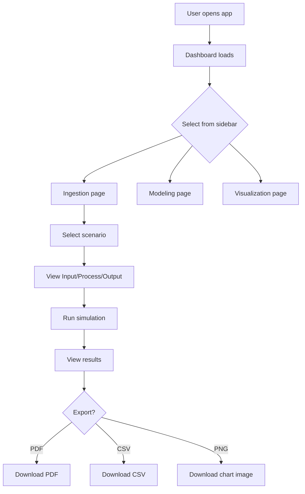

# Project Standards — Mandatory for ALL Projects

> These standards are auto-applied. No need to request them.

---

## 1. Tech Stack Rules

### Frontend
- **React** (latest stable) — functional components + hooks only
- **Native CSS** — CSS variables, no CSS-in-JS, no Tailwind unless explicitly requested
- **No hardcoding** — all URLs, API keys, ports from `.env`
- **Lazy loading** — all pages via `React.lazy()` + `Suspense`
- **Error boundaries** — wrap every route

### Backend (when needed)
- **FastAPI** (Python) or **Express** (Node.js)
- **ORM**: SQLAlchemy (Python) / Prisma (Node.js) / Better-SQLite3 (lightweight)
- **All SQL in repositories** — never in routers/services

### Database
- **SQLite** for local/dev (WAL mode + busy_timeout)
- **PostgreSQL** for production
- **Migrations**: numbered SQL files
- **Indexes**: on every WHERE/ORDER BY column

---

## 2. Layout Standard

```
+─────────────────────────────────────────+
| TOP BAR (fixed, dark)                    |
+──────────┬──────────────────────────────+
| SIDEBAR  | MAIN CONTENT                 |
| (left)   | (right, white background)    |
| 240px    | flex: 1                      |
| fixed    | scrollable                   |
| dark bg  | padding: 2rem                |
|          |                              |
| nav menu | Page content renders here    |
|          |                              |
+──────────┴──────────────────────────────+
```

- **Left side**: Navigation menu (collapsible)
- **Right side**: Content area (white background)
- **Topbar**: Fixed header with branding
- **Responsive**: Sidebar collapses on mobile

---

## 3. No Hardcoding Rules

| What | Wrong | Right |
|------|-------|-------|
| API URL | `fetch('http://localhost:8000')` | `fetch(process.env.REACT_APP_API_URL)` |
| Port | `app.listen(3000)` | `app.listen(process.env.PORT)` |
| Colors | `color: #ff3621` | `color: var(--primary)` |
| Strings | `"Submit"` in JSX | Extract to constants file |
| Timeouts | `setTimeout(fn, 5000)` | `setTimeout(fn, TIMEOUT_MS)` |
| Sizes | `width: 240px` inline | CSS variable `var(--sidebar-width)` |

---

## 4. File Handling Standards

### Supported Formats
| Format | Library | Usage |
|--------|---------|-------|
| **PNG/JPG** | Native ``, Canvas API | Display, export charts |
| **SVG** | Inline SVG, `<svg>` elements | Icons, diagrams, vector graphics |
| **PDF** | `jspdf`, `html2pdf.js` | Export reports, generate documents |
| **Word/DOCX** | `docx`, `html-docx-js` | Export formatted documents |
| **CSV** | Native JS, `papaparse` | Data import/export |
| **Excel** | `xlsx`, `exceljs` | Spreadsheet handling |
| **Markdown** | `marked`, `react-markdown` | Documentation display |

### Export Pattern
```jsx
// Every data page should have export options:
<ExportBar
  onExportPDF={() => exportToPDF(data)}
  onExportCSV={() => exportToCSV(data)}
  onExportPNG={() => exportToPNG(chartRef)}
/>
```

---

## 5. Research & Patent Portal Integration

### Search Paper Portals
| Portal | API | Use Case |
|--------|-----|----------|
| **Google Scholar** | SerpAPI / scholarly | Academic paper search |
| **arXiv** | arxiv.org/api | ML/AI research papers |
| **Semantic Scholar** | api.semanticscholar.org | Citation analysis |
| **PubMed** | eutils.ncbi.nlm.nih.gov | Medical/bio research |
| **IEEE Xplore** | ieeexplore.ieee.org/api | Engineering papers |
| **CrossRef** | api.crossref.org | DOI lookup, metadata |

### Patent Portals
| Portal | API | Use Case |
|--------|-----|----------|
| **Google Patents** | patents.google.com | Patent search |
| **USPTO** | developer.uspto.gov | US patent data |
| **EPO** | ops.epo.org | European patents |
| **WIPO** | patentscope.wipo.int | International patents |
| **Lens.org** | lens.org/api | Open patent/scholarly search |

### Integration Pattern
```jsx
// src/services/research.js
const RESEARCH_APIS = {
  arxiv: 'https://export.arxiv.org/api/query',
  semanticScholar: 'https://api.semanticscholar.org/graph/v1',
  crossref: 'https://api.crossref.org/works',
};

async function searchPapers(query, source) {
  const baseUrl = RESEARCH_APIS[source];
  // Implementation per source...
}
```

---

## 6. Comprehensive Testing List

### Frontend Tests
| Test | Tool | Priority |
|------|------|----------|
| Component renders | Jest + RTL | P0 |
| User interactions (click, type) | RTL userEvent | P0 |
| Form validation | Jest + RTL | P0 |
| Error boundary catches errors | Jest | P0 |
| Loading/error/empty states | Jest + RTL | P0 |
| Routing/navigation | RTL + Router | P1 |
| Responsive layout | Playwright viewport | P1 |
| Accessibility (ARIA) | jest-axe | P1 |
| CSS variables applied | Playwright visual | P2 |
| Dark mode (if applicable) | Playwright | P2 |
| Performance (no unnecessary re-renders) | React Profiler | P2 |
| Bundle size regression | size-limit | P2 |

### Backend Tests
| Test | Tool | Priority |
|------|------|----------|
| Health check endpoint | pytest/jest | P0 |
| CRUD operations | pytest/jest | P0 |
| Input validation (reject bad data) | pytest/jest | P0 |
| Auth (with key, without, wrong key) | pytest/jest | P0 |
| Error responses match envelope | pytest/jest | P0 |
| SQL injection prevention | pytest/jest | P0 |
| Pagination works | pytest/jest | P1 |
| Rate limiting | pytest/jest | P1 |
| Database migrations | pytest | P1 |
| Concurrent access | pytest + threading | P2 |
| Performance under load | locust/k6 | P2 |

### API Tests
| Test | Tool | Priority |
|------|------|----------|
| All endpoints return correct status codes | Playwright/httpx | P0 |
| Request/response schema validation | Pydantic/Zod | P0 |
| CORS headers present | curl/httpx | P0 |
| Security headers present | curl/httpx | P0 |
| Timeout behavior | httpx | P1 |
| Idempotency keys work | httpx | P1 |
| API versioning | httpx | P1 |
| Rate limit returns 429 | httpx | P1 |
| Large payload handling | httpx | P2 |
| Compression (gzip) works | httpx | P2 |

### E2E Tests
| Test | Tool | Priority |
|------|------|----------|
| App loads without errors | Playwright | P0 |
| All pages accessible | Playwright | P0 |
| No console errors | Playwright | P0 |
| Navigation works | Playwright | P0 |
| User demo scenarios | Playwright | P1 |
| Cross-browser | Playwright multi-project | P2 |
| Mobile responsive | Playwright viewport | P2 |
| Screenshot comparison | Playwright visual | P2 |

---

## 7. User Demo Scenarios

### Demo Flow Template
```markdown
## Demo: [Feature Name]

### Setup
- URL: http://localhost:3000/[page]
- Data: [pre-loaded or generated]

### Steps
1. Navigate to [page] via sidebar
2. [Action] — observe [result]
3. [Action] — observe [result]
4. [Action] — observe [result]

### Expected Output
- [Visual result]
- [Data result]
- [Export result]

### Screenshot
[Auto-captured by Playwright]
```

### Visual Flow Scenario Template


---

## 8. Prompt Tracking System

### Architecture
```
User Input → prompt-tracker.js → SQLite DB (data/prompts.db)
                                → MD file (data/prompt-history.md)
                                → Crash log (data/crash-recovery.md)
```

### Commands
```bash
node scripts/prompt-tracker.js --save "prompt text"     # Save prompt
node scripts/prompt-tracker.js --list                    # List recent
node scripts/prompt-tracker.js --search "keyword"        # Search
node scripts/prompt-tracker.js --export                  # Export JSON
node scripts/prompt-tracker.js --crash "type" "details"  # Log crash
```

### Database Schema
```sql
-- prompts: Every user input tracked
-- crash_log: System crash/error events
-- sessions: Group prompts by session
```

### Crash Recovery
- Every prompt is saved to BOTH SQLite AND markdown file
- If system crashes, markdown file survives (no DB corruption risk)
- Crash events logged separately for forensics
- On restart, can rebuild from markdown if DB is corrupted

---

## 9. Code Analysis & Debugging Standards

### Every Code File MUST Have
- **Purpose comment** — first line explains what the file does
- **No magic numbers** — extract to named constants
- **Error handling** — try/catch for async, ErrorBoundary for components
- **Debuggable** — meaningful variable names, no single-letter vars in logic

### Analysis Tools
| Tool | Purpose | Command |
|------|---------|---------|
| ESLint | Code quality | `npm run lint` |
| Prettier | Formatting | `npm run format` |
| SonarQube | Deep analysis | `/sonarqube:analyze` |
| CodeRabbit | AI review | `/coderabbit:review` |
| Lighthouse | Performance | Chrome DevTools |
| Bundle analyzer | Size analysis | `npx source-map-explorer` |

### Visualization Standards
- All charts must be exportable as PNG/SVG
- Use CSS variables for chart colors (consistent theme)
- Responsive — charts resize with container
- Accessible — color-blind safe palettes, ARIA labels

---

## 10. GitHub Workflow

### Repository Setup
```bash
# Initialize
git init
git remote add origin https://github.com/USERNAME/REPO.git

# Branch protection
# main: require PR review + CI pass
# develop: integration branch
```

### Push Workflow
```bash
git add -A
git commit -m "feat: description"
git push origin main
```

### Automated on Push
1. GitHub Actions CI runs: lint, test, build, E2E
2. PR template enforces checklist
3. Code review required before merge
