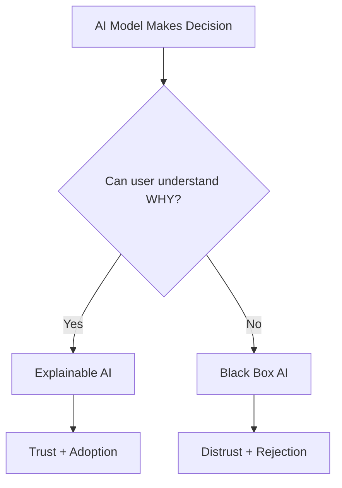
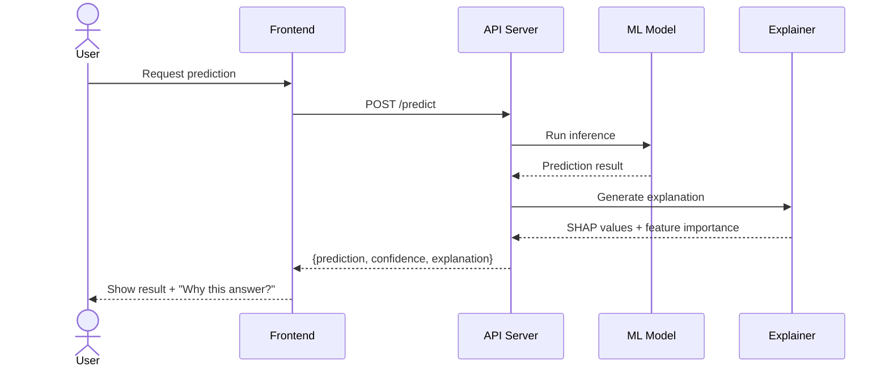
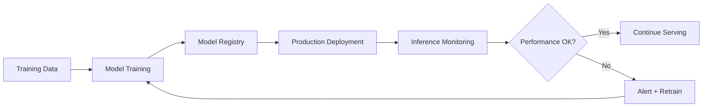

# AI Governance Guide — Responsible, Explainable & Interpretable AI

> For Tech Leads building AI-powered features in this project

---

## 1. Responsible AI (RAI) Framework

### Core Principles
| Principle | What It Means | How to Implement |
|-----------|--------------|-----------------|
| **Fairness** | No bias against protected groups | Bias testing, fairness metrics |
| **Transparency** | Users know when AI is involved | AI disclosure labels |
| **Accountability** | Clear ownership of AI decisions | Audit logs, decision trails |
| **Privacy** | Minimal data collection | Data minimization, anonymization |
| **Safety** | No harmful outputs | Content filtering, guardrails |
| **Reliability** | Consistent, predictable behavior | Testing, monitoring, fallbacks |

### RAI Checklist for Features
```markdown
## Before Launch
- [ ] Bias assessment completed (across demographics)
- [ ] Fairness metrics defined and measured
- [ ] User disclosure: "This feature uses AI"
- [ ] Opt-out mechanism available
- [ ] Data privacy review (GDPR/CCPA compliance)
- [ ] Fallback behavior when AI is unavailable
- [ ] Human-in-the-loop for high-stakes decisions
- [ ] Audit trail for AI decisions
- [ ] Performance monitoring dashboard
- [ ] Incident response plan for AI failures
```

---

## 2. Explainable AI (XAI)

### What Makes AI Explainable?


### XAI Techniques

| Technique | What It Does | When to Use | Library |
|-----------|-------------|-------------|---------|
| **SHAP** | Shows feature contribution to each prediction | Any ML model | `shap` |
| **LIME** | Local explanations for individual predictions | Complex models | `lime` |
| **Feature Importance** | Ranks which inputs matter most | Tree-based models | `scikit-learn` |
| **Attention Maps** | Shows what the model "looks at" | NLP/Vision models | `transformers` |
| **Counterfactuals** | "What would change the decision?" | Classification | `dice-ml` |
| **Partial Dependence** | How one feature affects predictions | Any model | `sklearn.inspection` |
| **Confusion Matrix** | Classification accuracy breakdown | Classification | `sklearn.metrics` |
| **SHAP Waterfall** | Step-by-step explanation of one prediction | Any model | `shap` |

### XAI Architecture Pattern


### XAI in Frontend (React Pattern)
```jsx
// Pattern: Always show AI predictions WITH explanations
function AIDecisionCard({ prediction, explanation }) {
  return (
    <div className="ai-decision">
      <div className="result">
        <h3>AI Recommendation: {prediction.label}</h3>
        <span className="confidence">
          Confidence: {(prediction.confidence * 100).toFixed(1)}%
        </span>
      </div>
      
      <details className="explanation">
        <summary>Why this recommendation?</summary>
        <div className="factors">
          {explanation.topFactors.map(factor => (
            <div key={factor.name} className="factor">
              <span>{factor.name}</span>
              <meter value={factor.impact} min={-1} max={1} />
              <span>{factor.impact > 0 ? 'Positive' : 'Negative'}</span>
            </div>
          ))}
        </div>
      </details>
      
      <footer className="ai-disclosure">
        This recommendation was generated by AI.
        <a href="/ai-policy">Learn more</a>
      </footer>
    </div>
  );
}
```

---

## 3. Interpretable AI

### Interpretability Spectrum
```
Simple/Interpretable ──────────────────── Complex/Black Box
Linear Regression    Decision Trees    Random Forest    Deep Learning
Rule-based           Logistic Reg      Gradient Boost   Transformers
  
  ◄── Inherently interpretable ──►  ◄── Needs XAI tools ──►
```

### Model Selection Guide
| Need | Recommended Approach | Interpretability |
|------|---------------------|-----------------|
| High-stakes decisions (medical, legal) | Linear models + rules | Inherent |
| Moderate risk (recommendations) | Tree ensembles + SHAP | Post-hoc |
| Low risk (content suggestions) | Any model + confidence scores | Minimal |
| Regulatory requirement | Interpretable model OR full XAI pipeline | Required |

### Interpretability Metrics
| Metric | Description | Target |
|--------|-------------|--------|
| **Faithfulness** | Does explanation match actual model behavior? | > 0.8 |
| **Stability** | Similar inputs get similar explanations? | > 0.9 |
| **Comprehensibility** | Can a non-expert understand it? | User tested |
| **Sufficiency** | Does explanation cover key decision factors? | All top-5 factors |

---

## 4. Performance AI Monitoring

### AI Model Performance Dashboard


### Key Metrics to Monitor
| Metric | Description | Alert Threshold |
|--------|-------------|----------------|
| **Accuracy** | Overall prediction correctness | Drop > 5% from baseline |
| **Latency (p95)** | Inference response time | > 500ms |
| **Throughput** | Predictions per second | < 80% of capacity |
| **Data Drift** | Input distribution change | PSI > 0.2 |
| **Concept Drift** | Relationship between input/output changes | Accuracy drops |
| **Prediction Distribution** | Output balance over time | Significant shift |
| **Error Rate** | Failed predictions | > 1% |
| **Confidence Calibration** | Are confidence scores accurate? | ECE > 0.1 |

### Model Card Template (for Documentation)
```markdown
## Model Card — [Model Name]

### Overview
- **Task**: Classification / Regression / Ranking
- **Version**: v1.0.0
- **Last trained**: 2026-04-15
- **Dataset**: [description, size, date range]

### Performance
| Metric | Training | Validation | Production |
|--------|----------|------------|------------|
| Accuracy | 95% | 93% | 92% |
| Precision | 94% | 92% | 91% |
| Recall | 96% | 94% | 93% |
| F1 | 95% | 93% | 92% |

### Fairness Assessment
| Group | Accuracy | False Positive Rate | False Negative Rate |
|-------|----------|--------------------|--------------------|
| Group A | 93% | 5% | 2% |
| Group B | 92% | 6% | 3% |

### Limitations
- [Known failure modes]
- [Data gaps]
- [Edge cases]

### Ethical Considerations
- [Potential for misuse]
- [Bias risks]
- [Recommended safeguards]
```

---

## 5. How to Use with Claude Code

| What You Want | What to Say |
|---------------|-------------|
| RAI assessment | "Run a Responsible AI assessment for this feature" |
| XAI integration | "Add SHAP explanations to the prediction API" |
| Model card | "Generate a model card for our ML model" |
| Bias analysis | "Analyze this model for fairness across demographics" |
| Monitoring setup | "Set up ML model monitoring with drift detection" |
| Interpretability | "Which model should I use for [high-stakes/low-risk] decisions?" |
| AI disclosure UI | "Add AI disclosure labels to this component" |
| Performance dashboard | "Create a model performance monitoring dashboard" |
