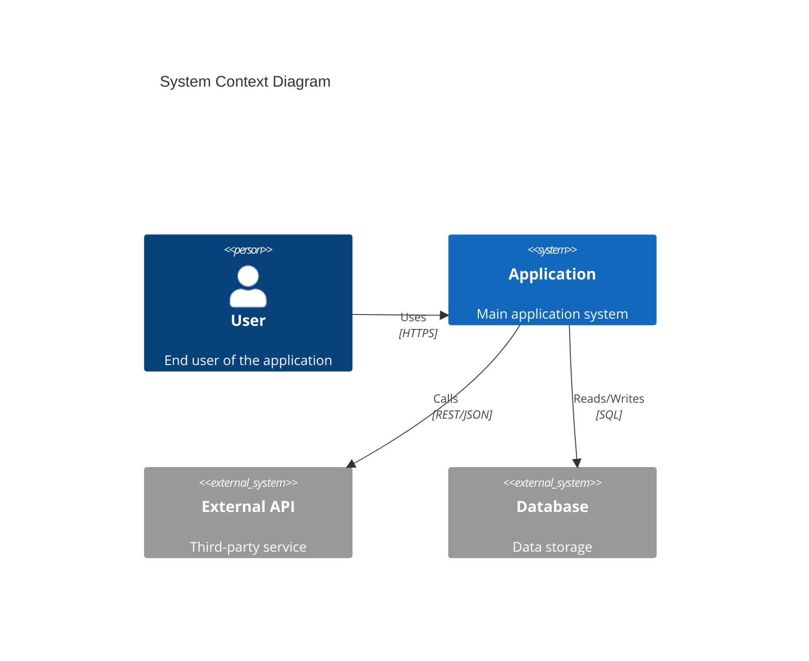
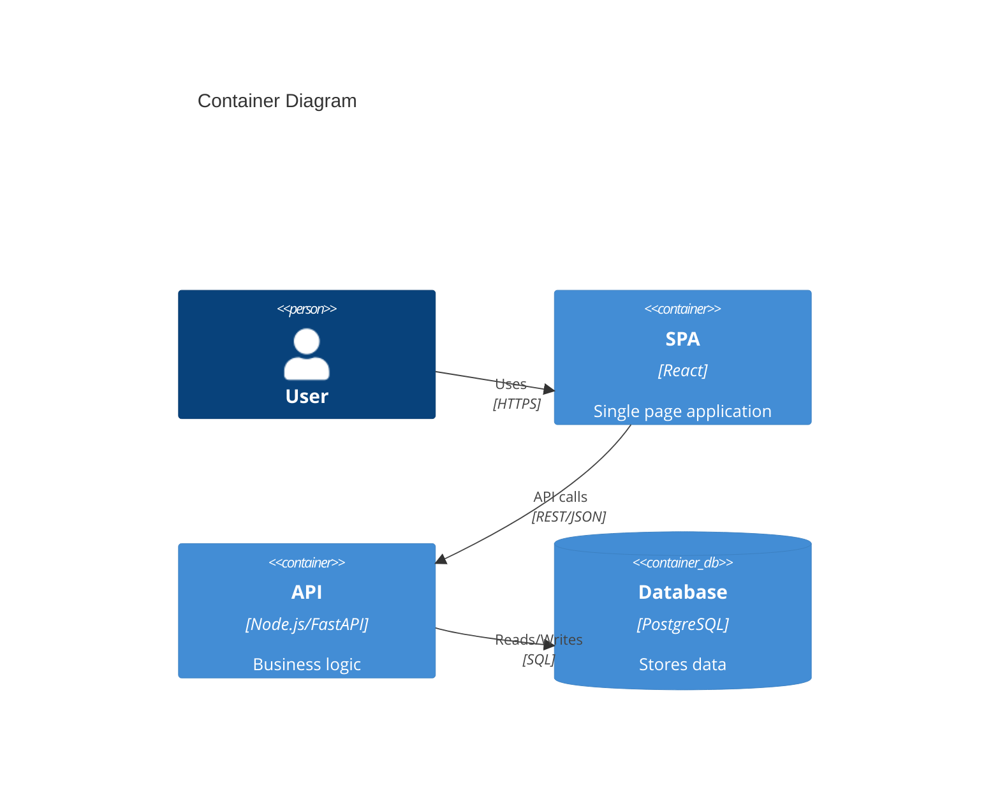
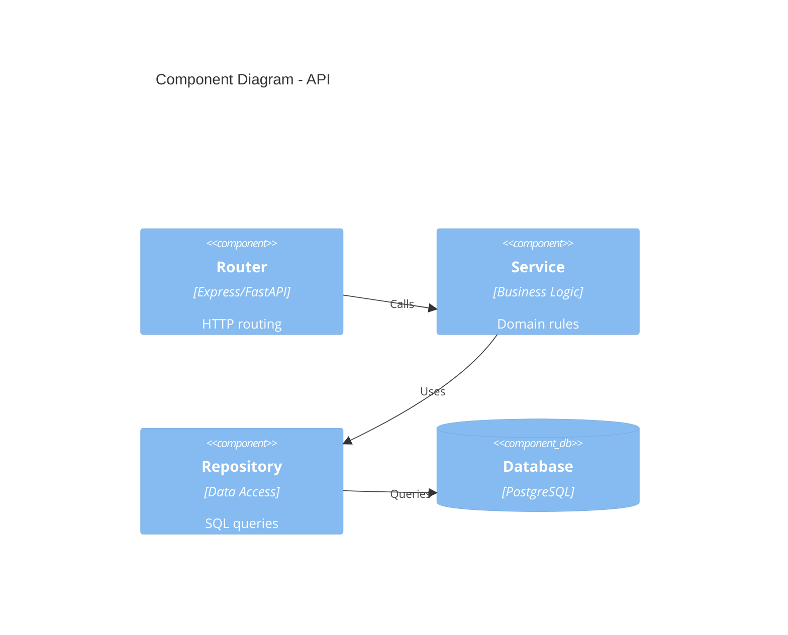
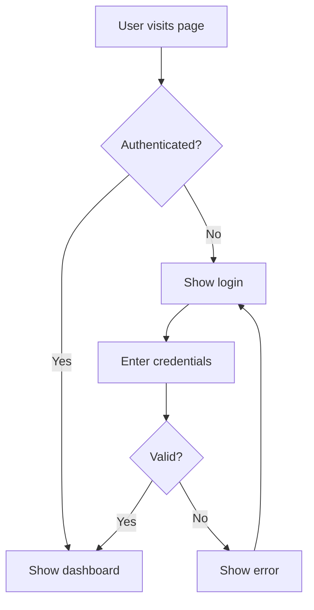
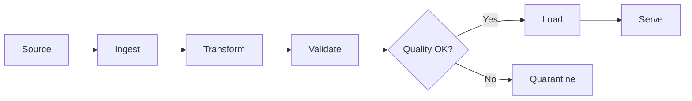
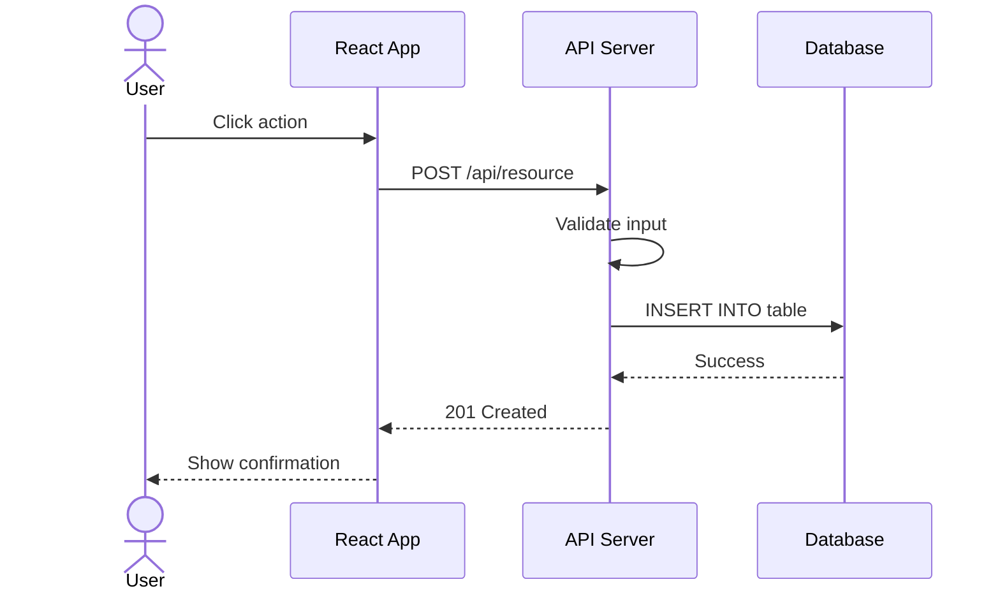
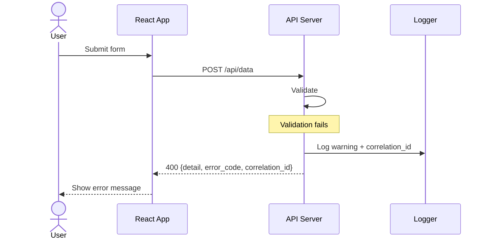

# Architecture Templates — Tech Lead Toolkit

> Use these templates with Claude Code. Just say: "Generate HLD for [feature]" or "Create C4 diagram for [system]"

---

## 1. High-Level Design (HLD) Template

```markdown
# HLD — [System/Feature Name]

## 1. Overview
- **Purpose**: What problem does this solve?
- **Scope**: What's in/out of scope?
- **Stakeholders**: Who are the users and teams involved?

## 2. Architecture Diagram (C4 Context Level)
[Mermaid diagram here — system context]

## 3. Key Components
| Component | Responsibility | Technology |
|-----------|---------------|------------|
| Frontend  | User interface | React      |
| API Layer | Business logic | Node/FastAPI |
| Database  | Data storage   | PostgreSQL |

## 4. Data Flow
[Sequence diagram — main user journey]

## 5. Non-Functional Requirements
| NFR | Target | Measurement |
|-----|--------|-------------|
| Availability | 99.9% | Uptime monitoring |
| Latency | <200ms p95 | APM tool |
| Throughput | 1000 RPS | Load test |
| Security | OWASP Top 10 | Security scan |

## 6. Technology Choices
| Decision | Choice | Alternatives Considered | Why |
|----------|--------|------------------------|-----|

## 7. Risks & Mitigations
| Risk | Impact | Probability | Mitigation |
|------|--------|-------------|------------|

## 8. Dependencies
- External APIs
- Third-party services
- Shared libraries
```

---

## 2. Low-Level Design (LLD) Template

```markdown
# LLD — [Component/Module Name]

## 1. Component Overview
- **Parent HLD**: Link to HLD document
- **Scope**: What this component handles

## 2. Class/Module Diagram
[Mermaid class diagram]

## 3. API Contracts
### Endpoint: POST /api/v1/resource
**Request**:
- Body: { field: type, ... }
- Headers: Authorization, Content-Type

**Response**:
- 200: { data: {...} }
- 400: { detail: "...", error_code: "VALIDATION" }
- 500: { detail: "...", error_code: "INTERNAL" }

## 4. Database Schema
[ERD diagram or table definitions]

## 5. State Machine (if applicable)
[State diagram for complex workflows]

## 6. Error Handling
| Error Scenario | Handler | Response | Recovery |
|---------------|---------|----------|----------|

## 7. Security Considerations
- Input validation rules
- Authentication/authorization
- Data encryption requirements

## 8. Testing Strategy
| Test Type | Coverage Target | Key Scenarios |
|-----------|----------------|---------------|
| Unit      | 80%            | Business logic |
| Integration | Key paths    | API contracts  |
| E2E       | Happy paths    | User journeys  |
```

---

## 3. Software Architecture Document (SAD) Template

```markdown
# SAD — [Project Name]

## 1. Executive Summary
One paragraph: what, why, for whom.

## 2. Architectural Goals & Constraints
### Goals
- Scalability, maintainability, security, performance

### Constraints
- Budget, timeline, team size, technology mandates

## 3. System Context (C4 Level 1)
[C4 Context diagram — system + external actors]

## 4. Container View (C4 Level 2)
[C4 Container diagram — apps, databases, message queues]

## 5. Component View (C4 Level 3)
[C4 Component diagram — internal structure of each container]

## 6. Deployment View
[Deployment diagram — servers, cloud services, networks]

## 7. Cross-Cutting Concerns
| Concern | Approach |
|---------|----------|
| Logging | Structured JSON, correlation IDs |
| Auth | JWT / API Keys |
| Monitoring | Prometheus + Grafana |
| CI/CD | GitHub Actions |
| Error Handling | Domain exceptions + error envelope |

## 8. Architecture Decision Records (ADR)
### ADR-001: [Decision Title]
- **Status**: Accepted
- **Context**: Why this decision was needed
- **Decision**: What was decided
- **Consequences**: Trade-offs accepted

## 9. Quality Attributes
[Table of NFRs with measurable targets]

## 10. Glossary
[Domain terms and definitions]
```

---

## 4. C4 Model Diagrams (Mermaid)

### Level 1 — System Context


### Level 2 — Container


### Level 3 — Component


---

## 5. Flowchart Templates

### User Journey


### Data Pipeline


---

## 6. Sequence Diagram Templates

### API Request Flow


### Error Handling Flow


---

## 7. How to Use with Claude Code

| What You Want | What to Say |
|---------------|-------------|
| Full HLD | "Generate an HLD for [feature/system]" |
| Low-level design | "Create an LLD for the [component] module" |
| SAD document | "Write a Software Architecture Document for this project" |
| C4 Context diagram | "Create a C4 context diagram for this system" |
| C4 Container diagram | "Create a C4 container diagram showing all services" |
| Sequence diagram | "Draw a sequence diagram for the [user action] flow" |
| Flowchart | "Create a flowchart for the [process/workflow]" |
| Architecture review | "Review this architecture from a tech lead perspective" |
| ADR | "Write an ADR for [decision]" |
