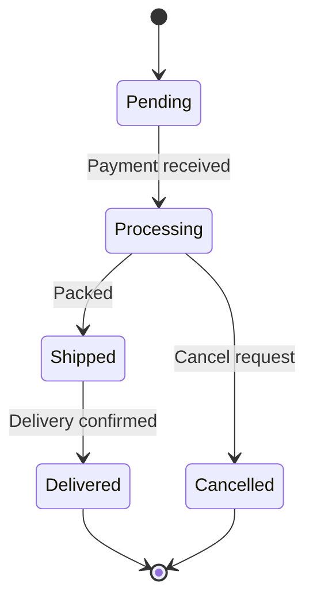
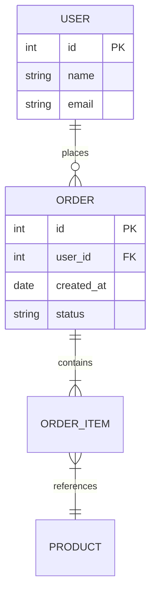

# Tech Lead Workflow — Claude Code Commands

> Quick reference for architecture and leadership tasks

---

## Architecture Commands (Say These to Claude)

### Design Phase
| Say This | What Happens |
|----------|-------------|
| "Generate HLD for user authentication" | Creates full HLD document with C4 diagrams |
| "Create LLD for the API layer" | Detailed component design with class diagrams |
| "Write SAD for this project" | Complete Software Architecture Document |
| "Create C4 context diagram" | System context Mermaid diagram |
| "Create C4 container diagram" | Container-level architecture diagram |
| "Draw sequence diagram for login flow" | Mermaid sequence diagram |
| "Create flowchart for data pipeline" | Mermaid flowchart |
| "Write ADR for choosing React over Vue" | Architecture Decision Record |

### Review Phase
| Say This | Plugin Used |
|----------|------------|
| "Review this from a tech lead perspective" | Native Claude analysis |
| "Review my code changes" | CodeRabbit |
| `/coderabbit:review` | Detailed AI code review |
| `/sonarqube:analyze src/App.js` | Static code analysis |
| `/simplify` | Code complexity reduction |
| "Is this architecture scalable?" | Native Claude analysis |
| "What are the security risks here?" | Security analysis |

### Debug Phase
| Say This | Plugin Used |
|----------|------------|
| "Debug why [issue]" | `superpowers:systematic-debugging` |
| "Profile performance of this page" | `chrome-devtools-mcp` |
| "Find memory leaks" | Chrome DevTools |
| "Optimize LCP" | `chrome-devtools-mcp:debug-optimize-lcp` |
| "Analyze bundle size" | Native + source-map-explorer |

### AI/ML Phase
| Say This | Reference |
|----------|-----------|
| "Run RAI assessment" | AI_GOVERNANCE_GUIDE.md |
| "Add explainability to predictions" | XAI section |
| "Generate model card" | Model Card template |
| "Check for bias" | Fairness assessment |

### Build & Ship Phase
| Say This | What Happens |
|----------|-------------|
| `npm run pre-merge` | Lint + test + build validation |
| `/commit` | Smart commit with message |
| `/commit-push-pr` | Full commit + push + PR creation |
| "Create PR" | PR with template checklist |

---

## Decision Framework

### When to Write an HLD
- New system or major feature
- Significant architecture change
- New external integration
- Performance/scalability redesign

### When to Write an LLD
- Complex component implementation
- API contract definition
- Database schema design
- State management design

### When to Write an ADR
- Technology choice (framework, database, cloud)
- Architecture pattern decision
- Trade-off between competing approaches
- Breaking change or deprecation

---

## Diagram Cheat Sheet

### Mermaid Diagram Types Available
```
flowchart TD    - Top-down flowchart
flowchart LR    - Left-right flowchart
sequenceDiagram - API/interaction flows
classDiagram    - Class/module structure
stateDiagram-v2 - State machines
erDiagram       - Database ERD
gantt           - Project timeline
pie             - Distribution charts
C4Context       - C4 system context
C4Container     - C4 container view
C4Component     - C4 component view
```

### Quick Diagram Examples

**Ask**: "Draw a state diagram for order processing"
**Get**:


**Ask**: "Create an ERD for user and orders"
**Get**:

